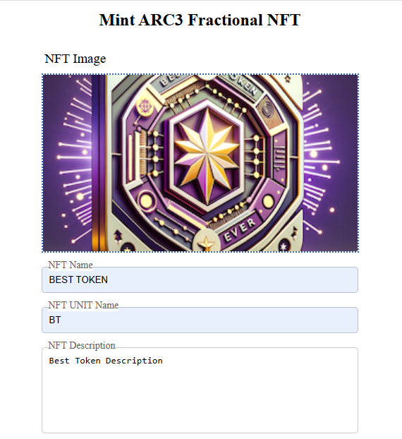
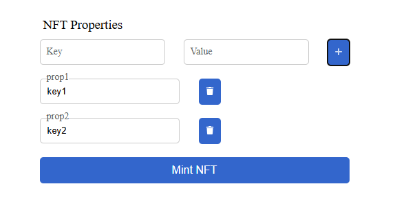
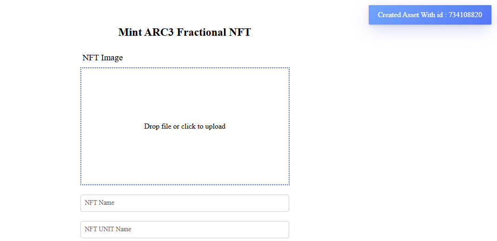

# Fractional NFT Creation

This project allows users to create ARC3 Fractional NFTs using the Algorand blockchain and Pinata for IPFS storage.

## Project Structure

```
fractional-nft/
├── templates/
│   └── index.html
├── static/
│   ├── toastify.css
│   └── toastify.js
├── .env
├── .env.sample
├── .gitignore
├── app.py
└── README.md
```

## Description

This project provides a web interface for users to mint ARC3 Fractional NFTs. Users can upload an image, provide metadata, and specify properties for the NFT. The image and metadata are pinned to IPFS using Pinata, and the NFT is created on the Algorand blockchain.

## Setup

### 1. Clone the repository

```bash
git clone https://github.com/yourusername/fractional-nft.git
cd fractional-nft
```

### 2. Create a virtual environment

```bash
python -m venv venv
```

### 3. Activate the virtual environment

- On Windows:
  ```bash
  venv\Scripts\activate
  ```
- On macOS/Linux:
  ```bash
  source venv/bin/activate
  ```

### 4. Install the required packages

```bash
pip install py-algorand-sdk flask requests python-dotenv
```

### 5. Set up environment variables

Create a `.env` file in the root directory and add the following variables:

```properties
ALGOD_ENDPOINT=your_algod_endpoint_here
API_KEY=your_api_key_here
PUBLIC_ADDRESS=your_public_address_here
MNEMONIC=your_mnemonic_here
TOKEN=your_token_here
PINATA_JWT=your_pinata_jwt_here
PINATA_KEY=your_pinata_key_here
PINATA_SECRET_KEY=your_pinata_secret_key_here
```

You can use the `.env.sample` file as a reference.

### 6. Run the application

```bash
python app.py
```

## Flow

1. **Home Page**: The user is presented with a form to upload an image and provide metadata for the NFT.

2. **Upload Image**: The user can drag and drop an image or click to upload.

   

3. **Fill Metadata**: The user fills in the NFT name, unit name, description, and properties.

   

4. **Mint NFT**: The user clicks the "Mint NFT" button to create the NFT. The image and metadata are pinned to IPFS, and the NFT is created on the Algorand blockchain.


5. **Notification**: The user receives a notification with the asset ID of the created NFT.

   
